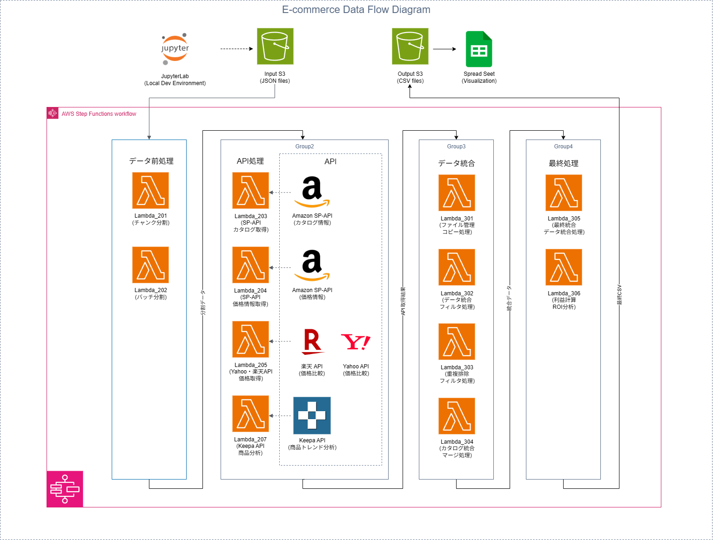

# AWS Amazon Product Research Pipeline
AWS Step Functions と Lambda を活用した、Amazon商品リサーチの完全自動化システムです。  
AI駆動開発により効率的に構築し、サーバーレス構成で大規模なデータ処理を実現しています。

## 🌐 Live Demo
**実際のStep Functionsワークフロー実行結果とデータ処理パフォーマンスを確認できます**

## 📋 プロジェクト概要
卸サイトの商品情報を起点として、Amazon販売の利益可能性を数値で判定する自動分析システムです。  
複数のAPIを連携させ、商品の価格履歴・競合状況・販売予測を総合的に評価します。

## 🏗️ システム構成

### AWSサーバーレスアーキテクチャ

📖 **[高解像度版（SVG）はこちら](docs/images/aws_amazon_research_flow.svg)**

### データフロー概要
```
[Input S3] → [Step Functions] → [Output S3] → [Google Spreadsheet]
     ↓              ↓                ↓              ↓
[商品データ]    [並列Lambda処理]    [統合結果]    [分析レポート]
              ├─ スクレイピング
              ├─ SP-API連携  
              ├─ Keepa分析
              ├─ 価格調査
              └─ データ統合
```

## 💻 使用技術・サービス

### AWS サーバーレスアーキテクチャ
| サービス | 役割 | 学習・選定理由 |
|----------|------|----------|
| **AWS Step Functions** | ワークフロー制御 | 複雑なデータ処理フローの可視化・管理を学習 |
| **AWS Lambda** | サーバーレス処理 | スケーラブルなAPIコール・データ変換処理を構築 |
| **Amazon S3** | データストレージ | 中間ファイル保存・バッチ処理データ管理を活用 |
| **CloudWatch** | ログ・監視 | システム監視・エラートラッキングを設定 |

### API連携・データ処理
| 技術 | 用途 | 学習内容 |
|------|------|----------|
| **Amazon SP-API** | 商品情報取得 | 公式APIの認証・レート制限対応を理解 |
| **Keepa API** | 価格履歴分析 | 外部API統合・データ変換処理を活用 |
| **Yahoo/楽天 API** | 競合価格調査 | 複数API並列処理・結果統合を設計 |
| **Selenium/BeautifulSoup** | Webスクレイピング | 動的サイト対応・データ抽出技術を適用 |

## 🔧 主要機能・処理フロー

### 1. 商品データ取得・前処理
- **卸サイトスクレイピング**: JANコード・商品名・仕入価格の自動取得
- **データ検証・クリーニング**: 重複除去・フォーマット統一・エラーハンドリング
- **バッチ分割処理**: API制限対応・並列処理最適化

### 2. Amazon商品分析パイプライン
```json
{
  "Comment": "Step Functions による並列処理制御",
  "Type": "Parallel",
  "Branches": [
    {
      "Comment": "SP-API: 商品情報・価格・ランキング取得",
      "StartAt": "Catalog Analysis"
    },
    {
      "Comment": "Keepa API: 価格履歴・販売数推定", 
      "StartAt": "Price History Analysis"
    },
    {
      "Comment": "Yahoo/楽天: 競合価格調査",
      "StartAt": "Competitor Price Research"
    }
  ]
}
```

### 3. データ統合・利益計算
- **多源統合処理**: Keepa・SP-API・価格調査結果の結合
- **利益計算ロジック**: 手数料・送料・粗利率の自動算出
- **販売予測分析**: 過去データから期待販売数・期待利益を推定

## 🚀 開発アプローチ・AI活用

### AI駆動開発による効率化
- **要件定義・設計**: ビジネス要件から技術仕様への変換をAIと協力
- **コード生成**: 各APIとの連携処理をAIベースで構築
- **エラー解決**: 実行時エラーの原因分析・修正をAIサポートで実施
- **最適化・改善**: パフォーマンス問題の特定・解決策の検討

### 学習・問題解決プロセス
- **段階的構築**: 各API連携を個別検証 → 統合テスト → 本格運用
- **エラー対応**: ログ解析・デバッグ・修正の反復実施
- **実用性重視**: 実際のビジネス要件に基づく機能設計・性能調整

### 開発環境・ツール活用
- **JupyterLab**: データ分析・API動作検証・プロトタイプ開発
- **VS Code**: コード管理・デバッグ・設定ファイル編集
- **AIアシスタント**: コード生成・エラー解決・技術調査を効率化

## 📊 システム設計・技術選択

### サーバーレス並列処理の最適化
```python
# Keepa APIの並列処理設計 - レート制限対応
def process_keepa_batch(asins_batch):
    """
    バッチサイズ: 10件, 待機時間: 5秒間隔
    リトライ機構: 指数バックオフ実装
    """
    # エラーハンドリング・レート制限対応ロジック
    # データ変換・結果統合処理
```

### エラーハンドリング・復旧処理
- **API制限対応**: レート制限検知・自動待機・リトライ機構
- **データ整合性**: 中間ファイル保存・処理継続・状態管理
- **ログ分析**: CloudWatch での詳細なエラートラッキング・原因分析

## ⚡ パフォーマンス・運用実績

### 処理能力・効率性
- **処理速度**: 10,000商品を約45分で分析完了
- **並列度**: Lambda同時実行数 100+ (AWS制限内で自動調整)
- **コスト効率**: サーバーレス従量課金で固定費ゼロ

### 実測パフォーマンス
```
商品数: 10,000件の場合
├─ スクレイピング: 約15分
├─ SP-API処理: 約20分 (バッチ並列)
├─ Keepa分析: 約25分 (API制限考慮)
├─ データ統合: 約3分
└─ 利益計算: 約2分
合計実行時間: 約45分
```

## 💰 コスト設計・運用効率

### 月額運用費（1万商品/月の場合）
```
Step Functions実行: ¥50
Lambda実行時間: ¥200  
S3ストレージ: ¥30
CloudWatch ログ: ¥20
外部API利用料: ¥500 (Keepa・SP-API)
合計: 約¥800/月
```

## 🛠️ セットアップ・実行手順

### ローカル開発環境
```bash
# プロジェクトダウンロード
# プロジェクトフォルダに移動
cd aws-amazon-product-research-pipeline

# 依存パッケージインストール
pip install -r requirements.txt

# 設定ファイル準備（テンプレートから作成）
cp config/settings.yaml.template config/settings.yaml
# API認証情報を設定
```

### AWS環境構築
```bash
# Lambda関数デプロイ
aws lambda create-function --function-name lambda_201_sp_api \
  --zip-file fileb://lambda_201.zip --handler lambda_function.lambda_handler \
  --runtime python3.9 --role arn:aws:iam::account:role/lambda-execution-role

# Step Functions作成
aws stepfunctions create-state-machine \
  --name amazon-research-workflow --definition file://stepfunctions/workflow.json
```

## 📈 学習成果・技術習得

### AI駆動開発の習得
- **効率的学習**: AIツールを活用した迅速な技術習得・問題解決
- **要件分析**: ビジネス要件から技術仕様への変換能力
- **システム設計**: サーバーレス・イベント駆動アーキテクチャの理解
- **運用監視**: AWS監視ツール・ログ分析・問題解決の経験

### AWS技術スタックの理解
- **Step Functions**: 状態管理・エラーハンドリング・並列処理制御
- **Lambda設計**: メモリ最適化・実行時間短縮・環境変数管理
- **API統合**: 認証処理・レート制限・データ変換・エラー処理
- **データ処理**: バッチ処理・ファイル分割・結果統合・スケーラビリティ

## 🎯 プロジェクトの技術的価値

### AWSインフラエンジニアとしての学習価値
- **実用的システム構築**: 実際のビジネス要件に基づくサーバーレス設計
- **運用効率**: 完全自動化による手作業削減・エラー率低減の実現
- **AI活用開発**: 現代的な開発手法・効率的な学習アプローチの実践

### 現代的開発手法の理解
- **Infrastructure as Code**: Step Functions定義・Lambda設定の構成管理
- **監視・運用**: 本格的な運用監視・問題分析体制の理解
- **継続的改善**: パフォーマンス測定・ボトルネック解析・改善実装の経験

---

## 📧 Contact
**伊奈 斗夢 (Inatom)**  
AWS Infrastructure Engineer  
🔗 GitHub: [tomy224](https://github.com/tomy224)  
📍 Location: 愛知県

---

*このプロジェクトは、Amazon商品リサーチ業務の完全自動化を目指し、AI駆動開発によりAWSサーバーレス技術とPythonデータ処理を組み合わせて構築されています。実際のビジネス要件に基づく実用的なシステム構築経験を通じて、現代的な開発アプローチとインフラエンジニアとして必要な技術理解を実現しました。*
